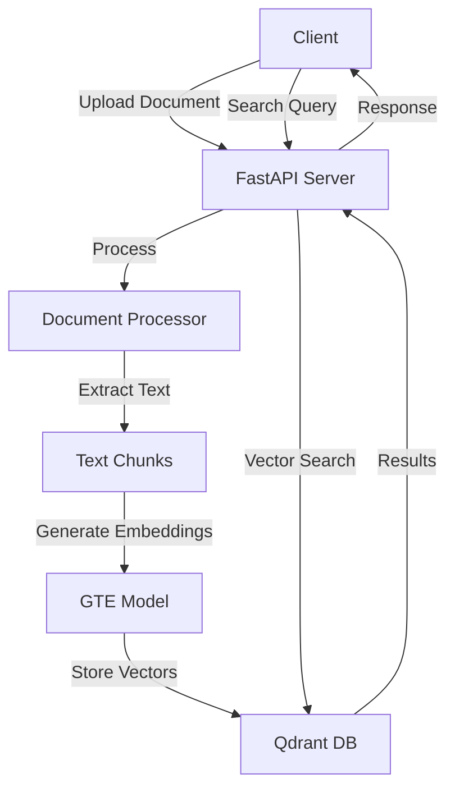

## 🏗 System Architecture

```mermaid
graph TD
    A[Client] -->|Upload Document| B[FastAPI Server]
    B -->|Process| C[Document Processor]
    C -->|Extract Text| D[Text Chunks]
    D -->|Generate Embeddings| E[GTE Model]
    E -->|Store Vectors| F[Qdrant DB]
    A -->|Search Query| B
    B -->|Vector Search| F
    F -->|Results| B
    B -->|Response| A
```
